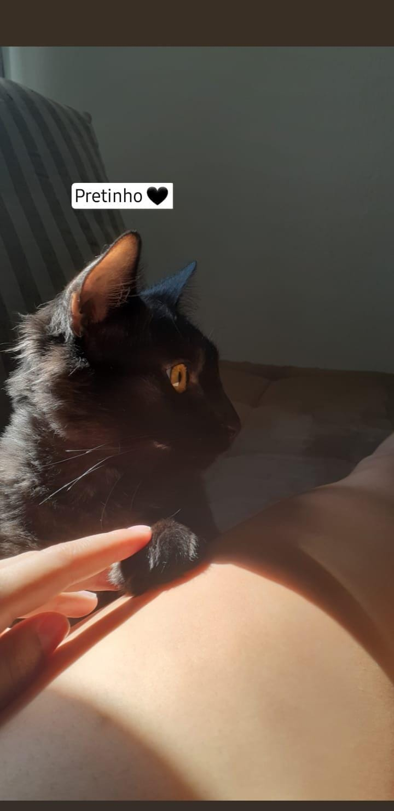

# 🐾 Lar Meaw Dote

> Uma plataforma para dar visibilidade ao trabalho de um abrigo independente de gatos — nascida do amor por um gatinho chamado **Pipoca**.

*(O nome “Lar Meaw Dote” soa como “**Lar, me adote**”, um lar pedindo pra ser encontrado.)*

---

## 💛 A história por trás do projeto

Na madrugada de **26 de junho de 2026**, meu gato **Pipoca** começou a passar mal. Quando acordei, ele estava quietinho e não queria ficar perto, o levei correndo ao veterinário.

Sem entender ainda o que havia acontecido, começamos a tratá-lo como uma intoxicação, porque era o que os sintomas indicavam. Mas o Pipoca **parou de comer**. Levei ele à clínica todos os dias, como me pediram, fizeram exames e todos os dias eu avisava que ele não estava se alimentando, mesmo depois de ter ficado 2 dias internado e terem dado alta da internação, todos os dias diziam que aquilo “fazia parte do quadro”, e me ignoravam.

Depois de **6 dias sem nenhuma melhora**, troquei de veterinário. Começamos um novo tratamento, os exames que me entregaram estavam incompletos, o exame de imagem não tinha imagem apenas um resumo, começamos um novo tratamento, ainda assim, ele não melhorava. Essa segunda clínica me encaminhou para um especialista. Foi o especialista quem finalmente encontrou o que estava acontecendo: um **corpo estranho**. O Pipoca havia sido diagnosticado errado desde o início, no dia 18 de julho de 2026 às 17h eu perdi minha bolinha.

Alguns dias depois, mexendo na internet, encontrei um lugar de adoção de gatos e vi o **Bolota**: mesma cor, mesmo tamanho, mesma idade, a mesma aparência do meu Pipoca. Foi ali que decidi transformar a minha dor em algo que ajudasse **outros gatinhos**.

Este projeto é isso: uma forma de ajudar esse abrigo a divulgar o trabalho que fazem, de forma autônoma, cuidando de gatos que só precisam de uma chance de serem vistos.

> *Em memória do Pipoca. 🐾*

<p align="center">
    
    <br/>
    <em>Pipoca 🤍</em>
</p>

---

## 🎯 A missão

- Dar **visibilidade** ao trabalho independente do abrigo, hoje feito de forma autônoma.
- Ajudar os gatinhos a serem **vistos e adotados**.
- Fazer isso com carinho e transparência, honrando a memória do meu Pipoca.

---

## 🐱 O abrigo

> 📝 **Lar Meaw Dote:** Uma organização empenhada em resgatar gatinhos abandonados e promover a adoção responsável para pessoas que se sensibilizem pela causa. Foi aqui que conheci o Bolota.

---

## 🛠️ Tecnologias & arquitetura

Este é, também, um **projeto de aprendizado**. Eu poderia resolver com uma stack bem menor — só com Next, por exemplo. Mas como estou estudando **Java**, escolhi de propósito construir a API com **Spring**, para aprender a montar a arquitetura completa de um back-end de verdade.

**Back-end (este repositório)**
- **Java 21**
- **Spring Boot 4.1.0** (Spring Web / MVC)
- **Maven** (com wrapper `mvnw`)
- Arquitetura **em camadas**: `Controller → Service → Repository`

**Front-end** *(repositório separado)*
- **Next.js**

[//]: # (> 📝 **A preencher:** link para o repositório do front-end em Next.)

---

## 📁 Estrutura do projeto

```
src/main/java/com/lar_meaw_dote_api
├── controller     → recebe as requisições HTTP e devolve as respostas
├── service        → regras de negócio
├── repository     → acesso aos dados
├── model          → entidades (representam os dados dos gatinhos)
├── dto            → formato dos dados que entram e saem da API
├── exception      → tratamento de erros
└── config         → configurações (CORS, segurança, etc.)
```

---

## 🚀 Como rodar (back-end)

**Pré-requisitos:** JDK 21 instalado.

```bash
./mvnw spring-boot:run
```

A API sobe em `http://localhost:8080`.

Exemplo de rota disponível:

```
GET http://localhost:8080/cats
```

---

## 📌 Status do projeto

🚧 **Em construção** — projeto de desenvolvimento e aprendizado. Cada etapa é um tijolo rumo à visão abaixo.

### 🎯 Onde este projeto quer chegar

- 🔐 **Área Admin** — publicar e fazer o CRUD completo dos gatinhos.
- 🌐 **Área Pública** — uma vitrine para atrair quem quer adotar.
- 🙌 **Área de Voluntariado** — vários tipos de ajuda (socializar e brincar, _video maker_, veterinária, transporte, lar temporário...), inclusive para quem só tem 30 minutinhos para dar.
- 💛 **Apadrinhamento** — escolher um gatinho e apoiar o cuidado com a saúde dele _(formato ainda em definição — com ou sem pagamento online)_.

> As três áreas não são sistemas separados: são **acessos com permissões diferentes** (via Spring Security) sobre os **mesmos dados** dos gatinhos.

### 🛤️ O caminho, por fases

**Fase 1 — Fundamentos da API** _(em andamento)_
- [x] **M1** — primeiro endpoint (`GET /cats`)
- [x] **M2** — camada de serviço + injeção de dependência
- [x] **M3** — persistência com banco de dados (JPA)
- [ ] **M4** — cadastro de gatos (`POST`) + DTOs + validação
- [ ] **M5** — tratamento de erros
- [ ] **M6** — testes automatizados

**Fase 2 — Acesso & Papéis**
- [ ] Autenticação e autorização (Spring Security)
- [ ] Separação das áreas Admin / Pública / Voluntariado
- [ ] Integração com o front-end em Next (CORS)

**Fase 3 — Domínios do produto**
- [ ] Adoção — adotante + pedido de adoção
- [ ] Voluntariado — voluntário + tipos de voluntariado + disponibilidade

**Fase 4 — Apadrinhamento** _(a amadurecer)_
- [ ] Modelar o apadrinhamento (padrinho + gatinho + plano de cuidado)
- [ ] Decidir o formato de apoio: com pagamento online (_gateway_) ou outra forma

---

[//]: # (## 🤝 Como ajudar)

[//]: # ()
[//]: # (> 📝 **A preencher:** como as pessoas podem apoiar o abrigo — adotar, doar, divulgar, ser lar temporário. Inclua os links de contato do abrigo.)

[//]: # ()
[//]: # (---)


*Feito com 💛 por Kathleen, em memória do Pipoca. Para que outros gatinhos encontrem um lar.*
